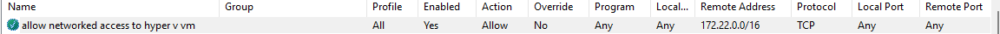
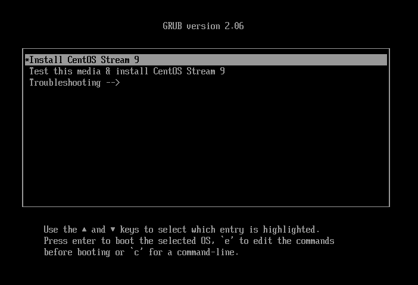
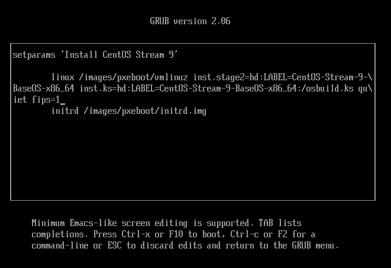
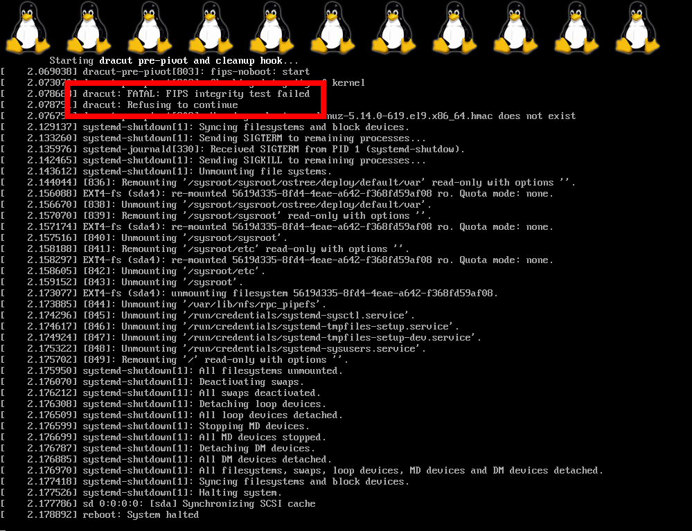
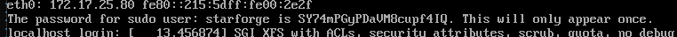

# Introduction

This acts as STARLAB's BootC Hub that contains the code and configurations required to maintain a centralised, hardened base CentOS BootC image, along with relavent variants (Bind Server, Bastion Host, PostgreSQL, HAProxy).

# Table of Contents

- [Introduction](#introduction)
- [Table of Contents](#table-of-contents)
- [Features](#features)
- [Generate Tailored CIS Benchmark](#generate-tailored-cis-benchmark-for-red-hat-enterprise-linux-9)
- [Building the Image](#building-the-image)
  - [Image Building](#image-building)
  - [Hardened Image building](#hardened-image-building)
  - [VM ISO](#vm-iso)
  - [Build Arguments](#build-arguments)
    - [Stock Arguments](#stock-arguments)
    - [Postgres Variant Arguments](#postgres-variant-arguments)
- [Running the Image](#running-the-image)
  - [Stock](#stock)
  - [Variant Postgres](#variant-postgres)
  - [Compliance Scanning](#compliance-scanning)
    - [Stock](#stock-1)
    - [Variant Postgres](#variant-postgres-1)
- [Development](#development)
  - [File Structure](#file-structure)

# Features

**Stock Features**

- Hardened to baseline CIS Level 2, with `openscap` built-in.
- [WIP] Vector installed and enabled for future log exporting.
- Variants can be defined as a build argument.

**Postgres Variant**

- Everything of Stock.
- PostgreSQL installed and initialised out of the box, with password for `postgres` user dynamically generated if needed.
- Metrics exposed via port 9100.
- Service account `postgres_exporter` created and configured to facilitate monitoring by postgres exporter.
- [WIP] Evaluation and implementation of backup strategy.

# Generate Tailored CIS Benchmark for Red Hat Enterprise Linux 9

Go into the directory of "tailoring_script" and run the following.

```
chmod +x generate_tailoring.sh

./tailoring_script/generate_tailoring.sh
```

The generated CIS xml file will be generated in the folder "/system_files/usr/share/ssg_cs9_ds_tailoring_generated.xml". You may than use this file to apply your hardening at build_scripts "39-harden-os-rhel9.sh" and also during compliance scanning.

# [OPTIONAL] Temporary Debug User

A temporary local user account can be created only for early-stage debugging and first-boot validation during image development, if intended. Actual image should not have this user.

Add the following in `image.toml`:

```
[[customizations.user]]
name = "debuguser"
description = "Temporary debug user to test first-boot scripts"
password = "changeme"
groups = ["wheel"]
```

The presence of this account is a temporary development control. All production images are to be built without local debug users.

# Building the Image

## Image Building

```
podman build . -f .\Containerfile -t localhost/centos-bootc:unhardened \
  --build-arg VARIANT="stock" # accepted values: stock, postgres
```

## Hardened Image building

```
podman build . -f .\Containerfile -t localhost/postgres-bootc:hardened \
  --build-arg VARIANT="stock" \
  --build-arg BOOTLOADER_PASSWORD="P@ssw0rd" \
  --build-arg HARDENED=true \
  --no-cache
```

```
podman build . -f .\Containerfile -t localhost/postgres-bootc:hardened \
  --build-arg VARIANT="postgres" \
  --build-arg BOOTLOADER_PASSWORD="P@ssw0rd" \
  --build-arg HARDENED=true \
  --build-arg DEFAULT_PASSWORD="P@ssw0rd" \
  --build-arg POSTGRES_EXPORTER_PASSWORD="P@ssw0rd" \
  --build-arg POSTGRESQL_REPLICATION_PASSWORD="P@ssw0rd" \
  --no-cache
```

After the image is built, follow on and build the ISO file.

## VM ISO

```
podman run --rm --name postgres-bootc-bootc-image-builder \
  --tty --privileged --security-opt label=type:unconfined_t \
  -v "${PWD}/output:/output" \
  -v /var/lib/containers/storage:/var/lib/containers/storage \
  -v "${PWD}/image.toml:/config.toml:ro" \
  --label bootc.image.builder=true \
  quay.io/centos-bootc/bootc-image-builder:sha256-b5a27308b23384279184f0217339b781fa38c19132d05f8e39ce8bf8af2ae5ef \
  localhost/postgres-bootc:hardened \
  --output /output \
  --local \
  --progress verbose \
  --type anaconda-iso \
  --target-arch amd64 \
  --rootfs ext4
```

// note: `--rootfs ext4` is important for centos due to lack of default storage configuration

// note: if using hyper-v as a hypervisor, you must go to firewall and allow outgoing traffic to hyper V VM IP


## Build Arguments

### Stock Arguments

| Argument Name                    | Description                                                                                                        | Default Value       | Usage Example                                          |
|----------------------------------|--------------------------------------------------------------------------------------------------------------------|---------------------|--------------------------------------------------------|
| `EL_VERSION`                     | The version of the CentOS-bootc container to be used. This defines which version of the CentOS stream is targeted. | `9`                 | `--build-arg EL_VERSION=9`                             |
| `ARCH`                           | The architecture of the container. Defines whether the container will be built for `x86_64`, `arm64`, etc.         | `x86_64`            | `--build-arg ARCH=x86_64`                              |
| `ADMIN_USERNAME`                 | The username of the admin account. This account will have a random password for each VM instance.                  | `starforge`         | `--build-arg ADMIN_USERNAME=xxx`                       |
| `HARDENED`                       | The flag that triggers a hardened build of the image.                                                              | `False`             | `--build-arg HARDENED=true`                            |
| `BOOTLOADER_PASSWORD`            | The password for the resulting bootloader. This is required when `HARDENED` = true                                 | No Default          | `--build-arg BOOTLOADER_PASSWORD=xxx`                  |

### Postgres Variant Arguments
>
> These arguments are only mandatory if the build argument `VARIANT=postgres`.  
>
| Argument Name                    | Description                                                                                                        | Default Value       | Usage Example                                          |
|----------------------------------|--------------------------------------------------------------------------------------------------------------------|---------------------|--------------------------------------------------------|
| `POSTGRESQL_USERNAME`            | The user generated to administer the postgres instance.                                                            | `postgres_user`     | `--build-arg POSTGRESQL_USERNAME=xxx`                  |
| `DEFAULT_PASSWORD`               | The default password for the user defined by `POSTGRESQL_USERNAME`. This will be set to immediately expire, necessating password change on first login                          | No Default          | `--build-arg DEFAULT_PASSWORD=xxx`           |
| `POSTGRESQL_MAJOR_VERSION`       | The major version of PostgreSQL to be used in the build.                                                           | `15`                | `--build-arg POSTGRESQL_MAJOR_VERSION=14`              |
| `POSTGRESQL_MINOR_VERSION`       | The minor version of PostgreSQL to be used in the build.                                                           | `10`                 | `--build-arg POSTGRESQL_MINOR_VERSION=4`               |
| `POSTGRES_EXPORTER_USER`         | The username of the service account that postgres_exporter is expected to use.                                     | `postgres_exporter` | `--build-arg POSTGRES_EXPORTER_USER=postgres_exporter` |
| `POSTGRES_EXPORTER_PASSWORD`     | The password of the service account that postgres_exporter is expected to use.                                     | No Default          | `--build-arg POSTGRES_EXPORTER_PASSWORD=xxx`           |
| `POSTGRESQL_REPLICATION_PASSWORD`| The password for the replication user created to run backups. This is required when `HARDENED` = true              | No Default          | `--build-arg POSTGRESQL_REPLICATION_PASSWORD=xxx`      |

# Running the Image

## Stock

In Podman:

```
# `--cap-add ipc_lock` is needed to enable the functions required for secret-tool
podman run -d --name postgres-bootc --cap-add ipc_lock localhost/postgres-bootc:hardened
podman exec -it postgres-bootc bash
```

As a VM:

- (IMPORTANT) - When installing the hardened image, it is important to do the following to enable FIPS mode (Ref: [Step 4](https://docs.redhat.com/en/documentation/red_hat_enterprise_linux/9/html/using_image_mode_for_rhel_to_build_deploy_and_manage_operating_systems/enabling-the-fips-mode-while-building-a-bootc-image#enabling-the-fips-mode-by-using-bootc-image-builder-tool_enabling-the-f_)
  - At the initial GRUB screen, press `e` to enter screen to edit the boot command
    
  - On the second command, append the boot parameter `fips=1`. Press `Ctrl+x` to continue the installation process.
    
    If this is not done, you will get a kernel panic once the installation is complete.
    
- (for administrators only) On initialisation, from the console, the password for admin user (user defined as  part of build argument) will be displayed. Log in using this user and configure the following when inside the JPE environment.
  
  - Store the password somewhere secure (like as a secret in-cluster)
  - Configure `/etc/chrony.conf` to point to the correct NTP server inside the environment.
  - This account will also then be used to run bootc upgrades in the future.
  - If running as variant, to run the other initialisation steps defined by the specific variant before restarting.
- (for administrators only) Set the grub password (Bootloader) to prevent unauthorized access to the system.
  - Run `sudo grub2-setpassword` to set the grub password. You will be prompted to enter the password twice. (Do save this password somewhere secure)
    ```bash
    sudo grub2-setpassword
    ```
  - By default, the GRUB username is `root`.
  - Reboot the system to apply the changes and test that the password is set correctly.
    At GRUB menu, press `e` or `c` to enter the edit mode and you should be prompted to enter the password.
  - What this does is that it automatically generates the PBKDf2 hash and stored it securely in `/boot/grub2/user.cfg`.


## Variant Postgres

- As part of the build process, a default password for the `postgres_user` user will be created that is set to expire immediately. Log in using that user and reset the password. This user is a superuser to the database instance.
- In this shell, just run `psql` to enter the postgres instance as `postgres_user`. Create other users such as DB Admins here.
- If remote connection is needed through the `postgres_user` superuser, run `just retrieve-postgres-password` as `postgres_user` to initialize a password.
- (for administrators only) On initialisation, from the console, the password for admin user (user defined as  part of build argument) will be displayed. Log in using this user and configure the following when inside the JPE environment.
  - Use the internal CA to generate a set of TLS certificates. Restart by running `systemctl restart postgresql-<version>`.

  ```
  PGDATA=$(systemctl show -p Environment "postgresql-15.service" | sed 's/^Environment=//' | tr ' ' '\n' | sed -n 's/^PGDATA=//p' | tail -n 1)
  # move root-ca.crt, server.key, server.crt into $PGDATA directory

  chown postgres:postgres $PGDATA/root-ca.crt $PGDATA/server.key $PGDATA/server.crt
  chmod 600 $PGDATA/root-ca.crt $PGDATA/server.key $PGDATA/server.crt
  ```

## Compliance Scanning

Compliance scans can only be triggered by the admin user.

### Stock

```
# Run this as sudo
sudo oscap info /usr/share/xml/scap/ssg/content/ssg-cs9-ds.xml

# Scan for CIS Level 2 Compliance
sudo oscap xccdf eval --profile xccdf_org.ssgproject.content_profile_cis --report <dir> /usr/share/xml/scap/ssg/content/ssg-cs9-ds.xml

OR

sudo oscap xccdf eval \
  --tailoring-file /usr/share/ssg-cs9-ds-tailoring.xml \
  --profile xccdf_org.ssgproject.content_profile_cis_customized \
  --report /var/home/starforge/cis-report.html  \
  /usr/share/xml/scap/ssg/content/ssg-cs9-ds.xml

```

### Variant Postgres

Database compliance scan can only be triggered by the `postgres` user.

```
# Run this as sudo
su postgres
pgdsat > report.html
```

# Development

## File Structure

File structure referenced from: <https://github.com/ublue-os/bluefin-lts>

```
/ (Root)
├── build_scripts/ # Scripts to be executed at build time. `build.sh` will automatically be run, and will execute other scripts in a numerical order before running `cleanup.sh`
│   ├── 00_workarounds.sh # basic workarounds
│   ├── 1X_script.sh # non-variant specific tool installation
│   ├── 2X_script.sh # variant specific app installation
│   ├── 3X_script.sh # hardening scripts
│   ├── build.sh
│   └── cleanup.sh
├── system_files/ # Directories under here will be transferred in a direct mirror to a Linux filysystem
│   └── <directories>
├── Containerfile
├── image.toml
├── iso.toml
├── Justfile
├── README.md
└── .gitignore
```
