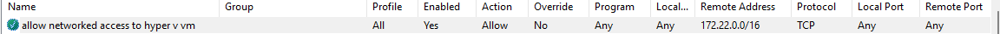
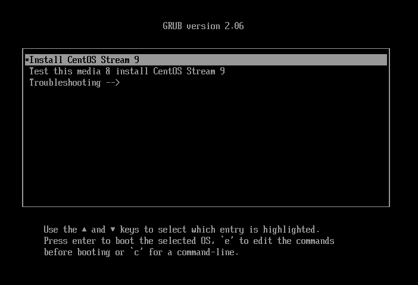
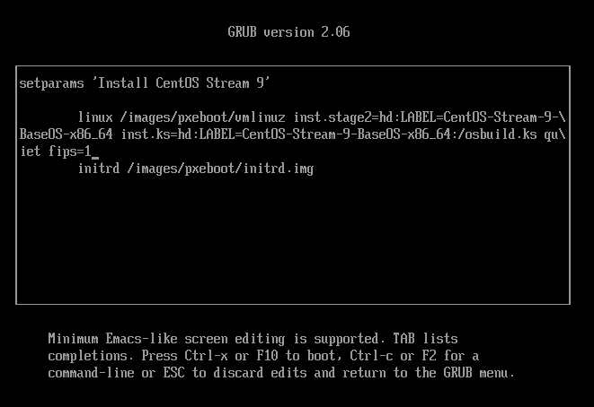
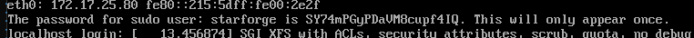

# Introduction

This repo contains the code and configurations required to maintain a centralised, hardened base CentOS BootC image, along with relavent variants (Bind Server, Bastion Host, PostgreSQL, HAProxy).

# Table of Contents

- [Current Features](#current-features)
- [Development Reference](#development-reference)
  - [File Structure](#file-structure)
  - [Build Arguments](#build-arguments)
- [Manual Operations](#manual-operations)
  - [Building the Image Locally](#building-the-image-locally)
  - [Building a VM ISO](#building-a-vm-iso)
  - [Running the Image](#running-the-image)
  - [Compliance Scanning](#compliance-scanning)
- [Tooling](#tooling)
  - [Generate Tailored CIS Benchmark](#generate-tailored-cis-benchmark)
  - [Temporary Debug User](#temporary-debug-user)

---

# Current Features

**Stock (all variants include this)**

- Hardened to baseline CIS Level 2, with `openscap` built-in.
- `node-exporter` installed and enabled for metrics.
- [WIP] Vector installed and enabled for future log exporting.

**Postgres Variant**

- Everything in Stock.
- PostgreSQL 17 installed and initialised on first boot — no manual setup required.
- Admin database user (`postgres_user`) created with an expiring default password, forcing a reset on first login.
- Service account `postgres_exporter` created with `pg_monitor` privileges to support Prometheus-based monitoring.
- Metrics exposed via port 9100.
- [WIP] Backup strategy evaluation in progress.

---

# Development Reference

View workflows in [GitHub Actions](https://github.com/STARLAB1733/starlab-bootc-hub/actions).
- Click into workflow to download release artifacts.

To add or modify variants, see [CONTRIBUTING.md](CONTRIBUTING.md).

## File Structure

```
/ (Root)
├── .github/
│   ├── workflows/          # CI pipeline definitions (pr-ci, merge-promotion, tag-release, lint)
│   └── variant-tests/      # Variant-specific functional test scripts
│       └── <variant>/      # e.g. postgres/ — scripts here run inside the booted container
├── build_scripts/          # Scripts executed at image build time
│   ├── common/             # Runs for every variant (build.sh orchestrates these numerically)
│   │   ├── 00-*.sh         # Workarounds and base setup
│   │   ├── 1X-*.sh         # Non-variant tool installation (node-exporter, vector, etc.)
│   │   ├── 3X-*.sh         # Hardening scripts
│   │   └── build.sh        # Entry point — copies system_files, substitutes placeholders, runs scripts
│   └── <variant>/          # e.g. postgres/ — variant-specific install scripts (2X-*.sh)
├── system_files/           # Mirrored directly onto the OS rootfs at build time
│   └── opt/                # Runtime scripts (init scripts, boot scripts)
│   └── usr/lib/systemd/    # Systemd unit files
├── Containerfile           # OCI image definition
├── image.toml              # bootc-image-builder config for ISO generation
├── Justfile                # Developer convenience commands
└── service_design/         # Architecture documentation
```

## Build Arguments

### Stock Arguments

| Argument              | Description                                             | Default     |
| --------------------- | ------------------------------------------------------- | ----------- |
| `EL_VERSION`          | CentOS Stream version                                   | `9`         |
| `ARCH`                | Target architecture                                     | `x86_64`    |
| `ADMIN_USERNAME`      | Admin OS account name                                   | `starforge` |
| `HARDENED`            | Enables hardened build (CIS, FIPS, bootloader password) | `false`     |
| `BOOTLOADER_PASSWORD` | GRUB password — required when `HARDENED=true`           | —           |

### Postgres Variant Arguments

> Required only when `VARIANT=postgres`.

| Argument                          | Description                                                             | Default             |
| --------------------------------- | ----------------------------------------------------------------------- | ------------------- |
| `POSTGRESQL_USERNAME`             | Admin database user created on first boot                               | `postgres_user`     |
| `DEFAULT_PASSWORD`                | Password for `POSTGRESQL_USERNAME` — expires immediately on first login | —                   |
| `POSTGRESQL_MAJOR_VERSION`        | PostgreSQL major version                                                | `17`                |
| `POSTGRESQL_MINOR_VERSION`        | PostgreSQL minor version                                                | `4`                 |
| `POSTGRES_EXPORTER_USER`          | Service account for Prometheus postgres_exporter                        | `postgres_exporter` |
| `POSTGRES_EXPORTER_PASSWORD`      | Password for the exporter service account                               | —                   |
| `POSTGRESQL_REPLICATION_PASSWORD` | Replication user password — required when `HARDENED=true`               | —                   |

---

# Manual Operations

> These steps are for local development and operator use. In normal workflow, the CI pipeline handles building, testing, and releasing automatically.

## Building the Image Locally

**Unhardened (development):**

```bash
podman build . -f Containerfile -t localhost/centos-bootc:dev \
  --build-arg VARIANT="postgres"
```

**Hardened:**

```
podman build . -f .\Containerfile -t localhost/stock:hardened \
  --build-arg VARIANT="stock" \
  --build-arg BOOTLOADER_PASSWORD="P@ssw0rd" \
  --build-arg HARDENED=true \
  --no-cache
```

```bash
podman build . -f Containerfile -t localhost/bootc-postgres:hardened \
  --build-arg VARIANT="postgres" \
  --build-arg HARDENED=true \
  --build-arg BOOTLOADER_PASSWORD="<password>" \
  --build-arg DEFAULT_PASSWORD="<password>" \
  --build-arg POSTGRES_EXPORTER_PASSWORD="<password>" \
  --build-arg POSTGRESQL_REPLICATION_PASSWORD="<password>" \
  --no-cache
```

## Building a VM ISO

```bash
podman run --rm --name bootc-image-builder \
  --tty --privileged --security-opt label=type:unconfined_t \
  -v "${PWD}/output:/output" \
  -v /var/lib/containers/storage:/var/lib/containers/storage \
  -v "${PWD}/image.toml:/config.toml:ro" \
  --label bootc.image.builder=true \
  quay.io/centos-bootc/bootc-image-builder:sha256-b5a27308b23384279184f0217339b781fa38c19132d05f8e39ce8bf8af2ae5ef \
  localhost/bootc-postgres:hardened \
  --output /output \
  --local \
  --progress verbose \
  --type anaconda-iso \
  --target-arch amd64 \
  --rootfs ext4
```

> `--rootfs ext4` is required for CentOS Stream 9 — the base image does not include a default storage configuration.

> If using Hyper-V, allow outbound traffic to the VM IP in Windows Firewall.
> 

## Running the Image

### As a container (podman)

```bash
podman run -d --name bootc-test --cap-add ipc_lock localhost/bootc-postgres:hardened
podman exec -it bootc-test bash
```

### As a VM (ISO install)

**Hardened image — enable FIPS at first boot:**

At the GRUB screen press `e` to edit the boot entry. Append `fips=1` to the kernel line. Press `Ctrl+x` to boot. Skipping this causes a kernel panic after install.




**First-boot admin steps (administrators only):**

1. The admin user password is displayed on the console at first boot — record it securely.
   
2. Configure `/etc/chrony.conf` to point to the correct NTP server.
3. Set the GRUB password to prevent unauthorised boot access:

   ```bash
   sudo grub2-setpassword
   ```

   The hash is stored in `/boot/grub2/user.cfg`. Default GRUB username is `root`.

   Reboot the system to apply the changes and test that the password is set correctly.
   At GRUB menu, press `e` or `c` to enter the edit mode and you should be prompted to enter the password.

   What this does is that it automatically generates the PBKDf2 hash and stored it securely in `/boot/grub2/user.cfg`.

### Postgres variant — first-boot steps

1. As part of the build process, a default password for the `postgres_user` user will be created that is set to expire immediately. Log in using that user and reset the password. This user is a superuser to the database instance.
2. In this shell, just run `psql` to enter the postgres instance as `postgres_user`. Create other users such as DB Admins here.
3. If remote connection is needed through the `postgres_user` superuser, run `just retrieve-postgres-password` as `postgres_user` to initialize a password.
4. (for administrators only) On initialisation, from the console, the password for admin user (user defined as part of build argument) will be displayed. Log in using this user and configure the following when inside the JPE environment.

- Use the internal CA to generate a set of TLS certificates. Restart by running `systemctl restart postgresql-<version>`.

```
PGDATA=$(systemctl show -p Environment "postgresql-15.service" | sed 's/^Environment=//' | tr ' ' '\n' | sed -n 's/^PGDATA=//p' | tail -n 1)
# move root-ca.crt, server.key, server.crt into $PGDATA directory

chown postgres:postgres $PGDATA/root-ca.crt $PGDATA/server.key $PGDATA/server.crt
chmod 600 $PGDATA/root-ca.crt $PGDATA/server.key $PGDATA/server.crt
```

## Compliance Scanning

Compliance scans require the admin user.

**CIS Level 2 scan:**

```bash
# Run this as sudo
sudo oscap info /usr/share/xml/scap/ssg/content/ssg-cs9-ds.xml

# Scan for CIS Level 2 Compliance
sudo oscap xccdf eval --profile xccdf_org.ssgproject.content_profile_cis --report <dir> /usr/share/xml/scap/ssg/content/ssg-cs9-ds.xml

OR

sudo oscap xccdf eval \
  --tailoring-file /usr/share/ssg-cs9-ds-tailoring.xml \
  --profile xccdf_org.ssgproject.content_profile_cis_customized \
  --report /var/home/starforge/cis-report.html \
  /usr/share/xml/scap/ssg/content/ssg-cs9-ds.xml
```

**Postgres database compliance scan** (run as `postgres` user):

```bash
su postgres
pgdsat > report.html
```

---

# Tooling

## Generate Tailored CIS Benchmark

Run from the repo root:

```bash
chmod +x tailoring_script/generate_tailoring.sh
./tailoring_script/generate_tailoring.sh
```

The generated XML is written to `system_files/usr/share/ssg_cs9_ds_tailoring_generated.xml`. You may than use this file to apply your hardening at build_scripts "39-harden-os-rhel9.sh" and also during compliance scanning.

## [OPTIONAL] Temporary Debug User

A temporary local user account can be created only for early-stage debugging and first-boot validation during image development, if intended. Actual image should not have this user.

Add the following in `image.toml`:

```
[[customizations.user]]
name = "debuguser"
description = "Temporary debug user to test first-boot scripts"
password = "changeme"
groups = ["wheel"]
```

The presence of this account is a temporary development control. All production images are to be built without local debug users.
