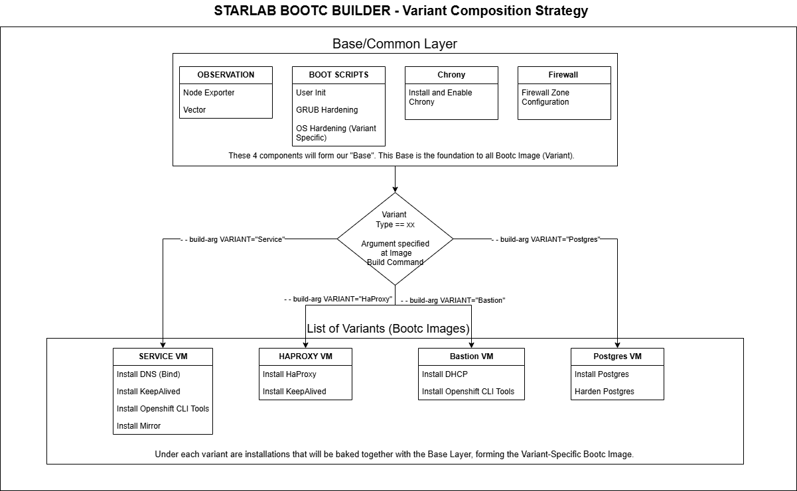

# BootC Builder RFC

| **Metadata**       | **Value**             |
|--------------------|-----------------------|
| **Status**         | V1            |
| **Authors**        | @lewyongjiun        |
| **Created**        | 02-01-2026            |
| **Last Updated**   | 05-02-2026            |
| **Decision Date**  | 04-02-2026       |
| **Approvers**      | @jingkang         |

## Change log

| Version | Date       | Changes                          | Author       |
|---------|------------|----------------------------------|--------------|
| v1.0    | 2025-02-05 | Initial Service Design                    | @lewyongjiun         |

## Motivation

The current approach boots VMs from a generic RHEL ISO and applies variant-specific configuration post-installation via scripts and/or Ansible. This makes variant behavior dependent on runtime execution and complicates consistency, upgrade validation, and early security gating. This RFC proposes using bootc to build versioned VM images (converted to ISOs) so baseline hardening and role capabilities are baked and validated at build time.

**1. Runtime configuration drift**

- VM variants are constructed by applying scripts and Ansible roles after installation from a generic RHEL ISO, making the final system state dependent on successful runtime execution.

- Repeated partial runs of playbook and manual intervention can cause systems to diverge from their intended variant definition, complicating debugging when runtime state no longer matches design intent.

**2. Non-deterministic upgrade and rollback model**

- OS upgrades, hardening changes, and package updates are to be applied in-place on running systems, making it difficult to validate the combined effect of changes as a single unit before rollout.

- Rollbacks require reversing a sequence of runtime configurations rather than switching to a known, versioned image, increasing operational risk and recovery time.

**3. Lack of CI-driven image validation and security gating**

- The current workflow does not produce a versioned image artifact that can be built, tested, and promoted through CI.

- Security checks such as CIS compliance and vulnerability scanning (e.g. Trivy) are performed after installation, rather than enforced as build-time gates on the image itself.

- As a result, security posture may not be reliably asserted before images are consumed.

**Why bootc?**

bootc enables VM images to be constructed as immutable, versioned artifacts rather than assembled at runtime from a generic RHEL ISO. By baking OS configuration, hardening, and baseline capabilities into the image itself, changes can be built, tested, scanned, and validated in CI before deployment.

This shifts critical concerns—such as upgrades, security compliance, and rollback—from live systems to the image build pipeline, enabling deterministic installs, safer upgrades, and reproducible security results.

### Scope

- Design and implementation of a Bootc Hub to build versioned VM images from a common hardened base with role-specific variants (e.g. bastion, service, HAProxy, Postgres).

- Definition of what is baked into bootc images versus what remains configured via Ansible.

## Design

**What is StarLab BootC Builder?**

The platform requires multiple VM variants (e.g. bastion, service, HAProxy, Postgres) that share a common OS baseline but differ in role-specific functionality. Bootc Builder allows these variants to be built from a single hardened base image, reducing duplication while ensuring consistency across builds.

The Bootc Builder is a controlled repository that composes, builds, and validates role-specific images using shared CI pipelines, security gates, and versioning, making image lifecycle management scalable as the number of VM variants grows.

### Proposed design

*Figure 1: Bootc Builder base and variants relation (Non-exhaustive) at build time*

### Proposed Bootc and Ansible components
This section describes what is installed into bootc images at **build time** and what is to-be configured via Ansible at **runtime** (after bootc image is booted) for each variant.

**Note:** Bootc builder is only largely intended for **build stage**, to install variant specific tools via bash scripts, ouputting ISO files. While our starforge-playbook (Ansible) will be used during **configuration stage** at runtime to configure variant specific services and tooling.

| Variant name | bootc (Installations) | ansible (Configurations) |
|----------|----------|----------|
| Base/Common  | **Observability:** - node_exporter - Vector  **Common boot scripts:** - user-init - grub hardening - OS hardening (Variant specific)  **Time & networking:** - Chrony (installed & enabled) - Firewall zone configuration  |   |
| Bastion  | **Provisioning services:** - DHCP  **Tooling:** - OpenShift CLI tools (oc, kubectl, oc-mirror)  | **Provisioning services:** - DHCP Configuration - Ignition Configuration - Firewall Configurations  **Tooling:** - Post Ignition Configurations (Openshift) - Operators Installation and Configurations |
| Service  | **Core services:** - DNS (BIND) - Keepalived - Mirror registry (Quay)  **Tooling:** - OpenShift CLI tools (oc, kubectl, oc-mirror)  | **Core services:** - DNS Configuration - KeepAlived Configuration - ntpServer chrony configurations - Firewall Configurations  **Tooling:** - Push Images to mirror  |
| HaProxy  | **Traffic & HA:** - HAProxy - Keepalived  |  **Traffic & HA:** - HaProxy Configuration - Set and start KeepAlived Configuration - ntpClient chrony Configurations - Firewall configurations|
| Postgres   | **Data services:** - PostgreSQL (install and harden)  |   |

### Limitation & Concerns

1. Image rebuild requirement for change

   Any change to base configuration, hardening, or baked tooling requires a full image build. This increases reliance on CI responsiveness and image promotion discipline.

2. Variant explosion risk

   Without clear boundaries, role-specific logic may multiply, leading to too many narrowly scoped images that are difficult to maintain.

3. Secret handling constraints

   Sensitive material (certificates, credentials) must not be baked into images and must remain provisioned post-installation, requiring careful Ansible separation.

4. Bootc hardening constraints

   Certain system configurations may be restricted by the immutability model and may require documented waivers.

5. Operational learning curve

   Teams must adapt from runtime configuration to image-first thinking, including new debugging and rollback workflows.

## Open questions and decisions 

1. Variant composition strategy

   Should variants be built via:

   - **conditional execution within a single repository (Base and Variant built together)**, or
   - layered images with explicit base → variant inheritance (Import in Base image and build on top of it)?

2. Binary sourcing policy

   Should tools like oc, kubectl, and oc-mirror be:

   - **dynamically downloaded at build time and version pin**, or
   - sourced and supplied internally?

## Appendix

### Non-goals

- This RFC does not aim to replace configuration management entirely; Ansible remains the mechanism for post-install and Day-2 configuration.
- This RFC does not change OpenShift node provisioning or cluster lifecycle management.
- This RFC does not cover CI/CD pipeline, Image Lifecycle and Change workflow.

### Improvements to be made
- Outline what is the opinionated practices that we have in order for this to work. Eg, The idea of type of action should be in which layer/stage, capturing the concept of installation via script within build stage and ansible for configuration via configuration stage. 
- What are the must do, in order to make sure the bootc variant can support upgrade etc. Eg, A necessary file is stored at diff directory at version 1, if version 2 is built, the file should be stored at diff directory. How do we handle such migration? Through Ansible? 
- Ansible part is not outlined clearly that it is a post step across the doc, would be neat to separate it in different stages and what happen in each stage.