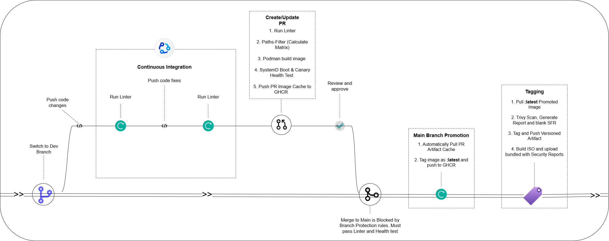

# BootC CI/CD Pipeline RFC

| **Metadata**       | **Value**             |
|--------------------|-----------------------|
| **Status**         | V2 (Path Filtering & PR Promotion) |
| **Authors**        | @lewyongjiun          |
| **Created**        | 2026-03-20            |

## Motivation

The `bootc-service-design` RFC establishes the shift toward building immutable, versioned VM images to prevent runtime configuration drift. This document serves as the implementation standard for the Continuous Integration (CI) and Release pipeline that enforces these guarantees. It defines the branching strategy, security gating, and artifact lifecycle.

## Pipeline Architecture

*Figure 1: Bootc CI/CD Pipeline architecture*

To optimize runner execution limits and establish strict security gating, the pipeline is decoupled into explicit execution phases powered by a dynamic matrix engine.

### 1. File Validation (`dev` branch & PRs)
To provide rapid feedback without consuming heavy build resources, commits pushed to development branches bypass image compilation.
- **Triggers:** Push to `dev`, PRs, and `main`.
- **Execution:** Runs static analysis (ShellCheck) and formatting checks (CRLF validation).

### 2. Pull Request Gating (Shift-Left Validation)
Before any code merges to `main`, it must successfully compile and boot an image. This prevents broken configurations from polluting the master branch.
- **Dynamic Build:** The `setup-matrix` job uses `dorny/paths-filter` to detect exactly which folders changed in the PR to strategically build only the affected variants (see explicit examples below).
- **SystemD Health Canary:** After compiling, the pipeline actually *boots* the image as a background VM (`podman run -d --systemd=always`). It waits 5 seconds and explicitly verifies that the `node-exporter` user-service is running (`systemctl is-active node-exporter`). If the kernel panics or the SystemD init chain crashes before reaching user space, the pipeline fails instantly!
- **Artifact Caching:** If all tests pass, the artifact is pushed to the registry securely mapped to the PR integer (e.g., `ghcr.io/...:pr-55`).

### 3. Merging to Main (Artifact Promotion)
The master branch serves as the source of truth, but **we do not compile images on `main`**.
- **Execution:** When a PR safely merges to `main`, a lightning-fast GitHub Agent runs `podman pull ...:pr-55` (grabbing the exact image vetted in the step above).
- **Promotion:** It simply tags it as `:latest` and pushes it back up. This guarantees your `:latest` baseline is mathematically identical to what was tested.

### 4. Release & Tagging (`v*` / `*-v*` tags)
When a semantic release tag is cut on `main`, the pipeline executes the full ISO generation and security auditing suite.
- **Instant Pull:** It completely bypasses `podman build` and immediately pulls the `:latest` image!
- **Audit:** Executes Trivy severity scans (High/Critical). Generates a vulnerability report and a blank Software Evaluation Report (SFR) required for software compliance.
- **ISO Wrap:** Utilizes `bootc-image-builder` to wrap the immutable container into a bootable Anaconda ISO (`.iso.part-*`).
- **Release:** Attaches the finalized ISO splits, Trivy Report, and SFR file directly to the GitHub Release.

## Dynamic Variant Matrix Engine
Building all VM variants concurrently exhausts CI quotas. Instead, the pipeline utilizes a powerful `dorny/paths-filter` engine that intelligently dictates exactly which variants (e.g., `postgres`, `haproxy`) are built based on your Git Diff intent:

### Scenario A: Working on a Pull Request
If an engineer opens a Pull Request modifying variant-specific files, the pipeline automatically senses the intent:
*   **Example 1:** You edit `build_scripts/postgres/install.sh`. The CI detects the path collision and automatically instructs GitHub Actions to only spin up **1 runner** (`postgres`) to save compute bandwidth.
*   **Example 2:** You edit `build_scripts/common/11-install-node-exporter.sh` or the root `Containerfile`. Because these are core architectural files, the CI detects a wide-impact change and safely instructs GitHub Actions to spin up **4 runners** to rebuild `postgres`, `haproxy`, `servicevm`, and `bastion` simultaneously!

### Scenario B: Generating a Release Tag
When cutting a release on `main`, the pipeline explicitly parses your tag naming convention to decide what to wrap into an ISO.
*   **Targeted Release:** If you push the tag `haproxy-v3.0`, the CI slices the text before the `-v` and intelligently generates purely a **1-variant deployment** for `haproxy`.
*   **Global Release:** If you push the generic tag `v3.0` (with no prefix), the CI fails to find a specific target and safely defaults to generating **4 simultaneous ISO deployments** (for `postgres`, `haproxy`, `servicevm`, and `bastion`) for the entire company fleet.

## Artifact & Secret Management
- **Secrets:** Build-time credentials (e.g., database passwords) are never baked into permanent image layers. They are supplied dynamically by GitHub Actions via `podman build --secret` and mounted into memory as `tmpfs` during the image compilation step.
- **Immutability Guarantee:** Because the Artifact Promotion strategy (described in phase 3) forces Release deployments to inherently reference identical layer hashes tested in the original Pull Request, there is absolutely zero risk of upstream `apt`/`yum` dependency drift occurring between the time a PR is evaluated and the week a deployment tag is ultimately cut!