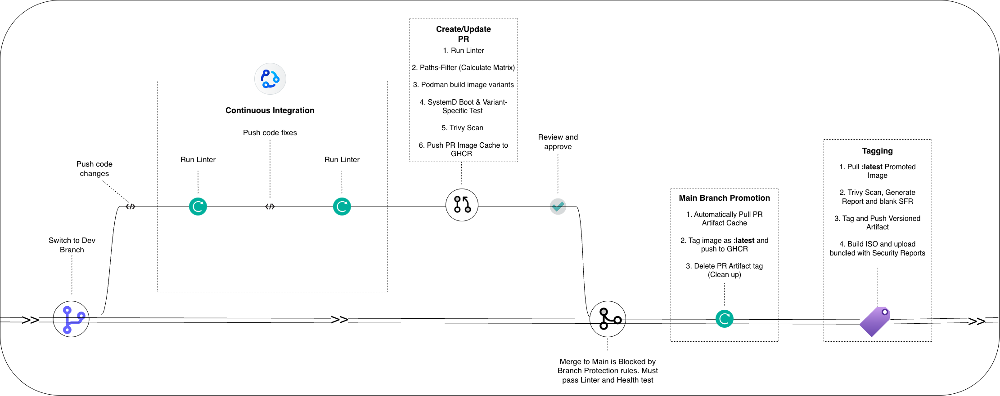

# BootC CI/CD Pipeline Service Design

| **Metadata** | **Value**                                    |
| ------------ | -------------------------------------------- |
| **Status**   | V3 (Variant Tests, Trivy Shift-Left, Tag Cleanup) |
| **Authors**  | @lewyongjiun                                 |
| **Created**  | 2026-03-20                                   |

## Motivation

This document captures the design of the CI/CD pipeline for building immutable, versioned OS images using bootc. It exists as a reference for understanding the system's architecture, variant logic, and artifact lifecycle — particularly the reasoning behind decisions that are not immediately obvious from reading the workflow files alone.

For a quick-start guide on how to use the pipeline day-to-day, see the root [README.md](../README.md).

---

## Understanding the OCI Image in This Pipeline

Before reading the pipeline phases, it is important to understand what the image actually is and what "testing" means at each stage.

The OCI image produced by this pipeline is not a traditional application container. It is a **full OS rootfs** — containing systemd units, kernel configuration, hardened services, and application services — packaged in the OCI format. The same image artifact serves two very different consumers:

### ISO / Bare Metal Boot Path

```
Image prepared   → OCI image contains OS rootfs, systemd units, configs, services
Install/deploy   → bootc-image-builder wraps the image into a bootable Anaconda ISO
Firmware stage   → UEFI/BIOS starts the bootloader
Bootloader stage → GRUB loads kernel + initramfs
Kernel stage     → Kernel initializes hardware, mounts early root
Initramfs stage  → Early userspace prepares real root, pivot/switch_root
Host init stage  → systemd starts as PID 1 on real host rootfs
Service stage    → System units start (network, exporters, app services)
Steady state     → Machine runs as OS host with persistent storage
```

### Podman Container Path (What CI Does)

```
Image prepared        → Exactly the same OCI image as above
Runtime setup         → Podman creates namespaces, cgroups, mounts container rootfs
Kernel reuse          → Uses the host kernel directly (no guest kernel boot)
PID 1 in container    → systemd starts as container PID 1 (--systemd=always)
Service stage         → systemd starts units in the container context
Smoke validation      → CI checks unit health, runs variant functional tests
```

### What the Podman CI Test Validates

| Validates | Does Not Validate |
|---|---|
| Userspace integrity (all expected files, configs, scripts present) | Firmware / bootloader / GRUB path |
| systemd unit wiring (units are enabled, dependencies correct) | Kernel / initramfs boot path |
| Service startup logic (init scripts run, services become active) | Real disk install / partition layout |
| Application-layer functionality (e.g., postgres accepts queries) | Full hardware boot semantics |

This distinction matters: a green CI run means the image's userspace and services are correct. It does not replace a full ISO boot test for hardware-specific validation.

---

## Pipeline Architecture


_Figure 1: Bootc CI/CD Pipeline architecture_

The pipeline is decoupled into execution phases to optimise runner usage and enforce strict gating at the right moments.

---

## Phase 1: File Validation (`dev` branch & PRs)

Commits pushed to development branches trigger lightweight static analysis — no image compilation.

- **Triggers:** Push to `dev`, PRs, `main`.
- **Execution:** ShellCheck (static analysis) and CRLF line-ending validation.

---

## Phase 2: Pull Request Gating (Shift-Left Validation)

Before any code merges to `main`, it must successfully compile, boot, pass functional tests, and clear a CVE scan. This prevents broken or vulnerable configurations from entering the main branch.

### Dynamic Build Matrix

The `setup-matrix` job uses `dorny/paths-filter` to detect exactly which directories changed and builds only the affected variants:

- **Common change** (e.g., `Containerfile`, `build_scripts/common/`) → all variants rebuild, because a shared change could break any image.
- **Variant-specific change** (e.g., `build_scripts/postgres/`) → only that variant rebuilds.
- **No recognised path changed** → matrix is empty, build job is skipped entirely.

### Boot Test and Canary

After compiling, the pipeline starts the image as a container under a full systemd PID 1 (`podman run -d --systemd=always`). It then verifies that `node-exporter` is active via `systemctl is-active`.

`node-exporter` acts as a **canary**: it sits at the end of the systemd dependency chain. If it is active, the entire unit graph — including any init scripts for the variant — executed successfully. If systemd panics, a service crashes, or an init script fails, `node-exporter` never reaches active state and the pipeline fails immediately.

### Variant-Specific Tests

Beyond the generic canary, each variant can define its own functional tests. Place shell scripts under:

```
.github/variant-tests/<variant-name>/
```

Every `*.sh` file in that directory is copied into the running container and executed in order. A non-zero exit from any script fails the pipeline. This is where variant engineers write application-level assertions — for example, verifying that `postgresql-17.service` is active and that `psql -c "SELECT 1;"` succeeds.

### Trivy Security Scan

Trivy scans for `HIGH` and `CRITICAL` CVEs **after** the boot test and variant tests pass. Scanning an image that cannot boot is wasteful — the earlier steps act as a gate so Trivy only runs on confirmed-functional images. The report is uploaded as a PR artifact.

### Artifact Snapshot

If all gates pass, the image is pushed to GHCR tagged as `:pr-{N}`. This snapshot is the exact artifact that will be promoted on merge — not rebuilt.

---

## Phase 3: Merging to Main (Artifact Promotion)

`main` is the source of truth, but **we never rebuild on main**.

When a PR merges:

1. The same path-filter logic from Phase 2 identifies which variants were affected.
2. The `:pr-{N}` snapshot is pulled from GHCR — the identical digest that passed all tests.
3. It is retagged as `:latest` and pushed. No `podman build`. Same layers. Same digest.
4. The `:pr-{N}` tag is deleted via the GitHub Packages API to keep the registry clean.
5. A verification pull confirms the tag is truly gone.

This guarantees that `:latest` is mathematically identical to what was tested. There is zero risk of dependency drift between test time and release time.

---

## Phase 4: Release & Tagging (`v*` / `*-v*` tags)

When a semantic release tag is cut on `main`:

- **Instant Pull:** Pulls `:latest` — bypasses `podman build` entirely.
- **Audit:** Trivy scan, vulnerability report, Software Evaluation Report (SFR).
- **ISO Wrap:** `bootc-image-builder` wraps the image into a bootable Anaconda ISO.
- **Release:** ISO splits, Trivy report, and SFR attached to the GitHub Release.
- **ISO Merge:** `cat bootc-<variant>.iso.part-* > bootc-<variant>.iso`

---

## Dynamic Variant Matrix — Worked Examples

### Scenario A: Working on a Pull Request

**Walk-through — Variant-only change:**

1. Engineer edits `build_scripts/postgres/21-install-postgres.sh` and opens a PR.
2. `setup-matrix` runs `dorny/paths-filter`. Only the `postgres` filter matches.
3. Matrix resolves to `["postgres"]`.
4. GitHub Actions spins up **1 runner** for the `postgres` variant only.
5. `haproxy`, `servicevm`, `bastion` are untouched — no runners allocated.
6. The postgres image is built, booted, tested, scanned, and snapshotted as `:pr-{N}`.

**Walk-through — Common/shared change:**

1. Engineer edits `build_scripts/common/11-install-node-exporter.sh` and opens a PR.
2. `setup-matrix` runs path-filter. The `common` filter matches.
3. Matrix resolves to `["postgres", "haproxy", "servicevm", "bastion"]`.
4. GitHub Actions spins up **4 parallel runners**, one per variant.
5. All variants are rebuilt and tested simultaneously. If node-exporter is broken for any variant, that runner fails and blocks the PR.

### Scenario B: Generating a Release Tag

**Walk-through — Targeted single-variant release:**

1. Engineer has finished a postgres change, reviewed, and it is on `main` as `:latest`.
2. Engineer runs: `git tag postgres-v2.1 && git push origin postgres-v2.1`
3. The release workflow parses the tag, extracts `postgres` (text before `-v`).
4. Matrix resolves to `["postgres"]`.
5. **1 runner** pulls `:latest` for postgres, runs Trivy, builds the ISO, attaches it to the GitHub Release.
6. Other variants are unaffected.

**Walk-through — Global fleet release:**

1. All variants have been validated and `:latest` is current for all.
2. Engineer runs: `git tag v3.0 && git push origin v3.0`
3. The release workflow finds no variant prefix in `v3.0`.
4. Matrix resolves to all four variants.
5. **4 parallel runners** each pull their respective `:latest`, scan, build ISOs, and attach to the release.

---

## Artifact & Secret Management

- **Secrets:** Build-time credentials are never baked into image layers. They are supplied via `podman build --secret`, mounted as `tmpfs` during compilation, and discarded when the build step completes.
- **Immutability Guarantee:** Because Phase 3 promotion forces `:latest` to reference the exact digest tested in Phase 2, there is zero risk of `yum`/`dnf` dependency drift between PR validation and deployment.
